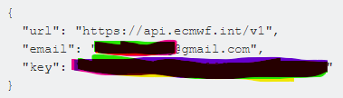

*********************************
Data Source server authentication
*********************************

-----
ECMWF
-----
1 - to be able to use earth2observe to download ECMWF data you need to register and setup your account in the ECMWF
website (https://apps.ecmwf.int/registration/)

2 - Install ECMWF key (instruction are here https://confluence.ecmwf.int/display/WEBAPI/Access+ECMWF+Public+Datasets#AccessECMWFPublicDatasets-key)
    (https://confluence.ecmwf.int/display/WEBAPI/Install+ECMWF+API+Key) (to get youe API key https://api.ecmwf.int/v1/key/)

- Copy/paste the key into a text file and save it to your $HOME directory as .ecmwfapirc (If you use
    Windows, you have to put the file in C:\Users\<USERNAME>\.ecmwfapirc

3- add environment variables in your command prompt type the following lines and press enter

.. code-block:: shell

    export ECMWF_API_URL="https://api.ecmwf.int/v1"
    export ECMWF_API_KEY="************"
    export ECMWF_API_EMAIL="<your-email>"

------
CHIRPS
------
- CHIRPS data source provides the data through a FTP server that is public and does not need and kind of registration

---------
Amazon-S3
---------
- The era5_bucket provides the data publically and does not require registering in amazon aws to download the data.
